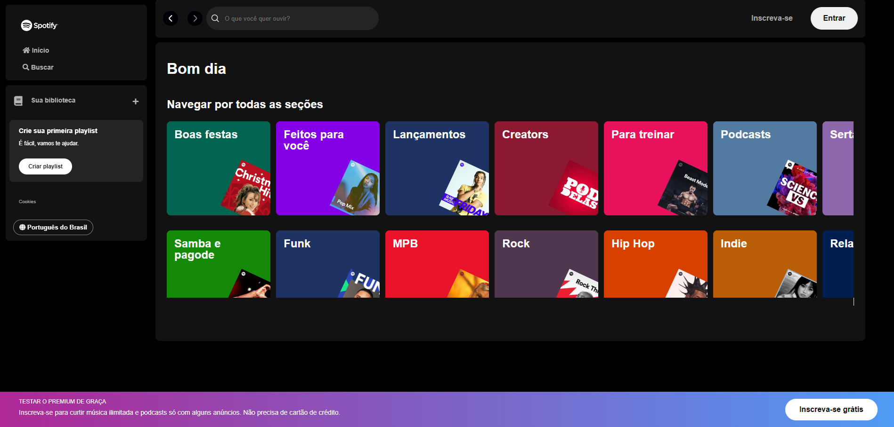

# Página Spotify

Projeto de reprodução da interface do Spotify desenvolvido com HTML, CSS e Javascript no evento da empresa Alura. Consiste na recriação de menus e botões com a área principal destinada aos cards dos artistas, onde há o uso do scroll para visualizar todos os cards.

